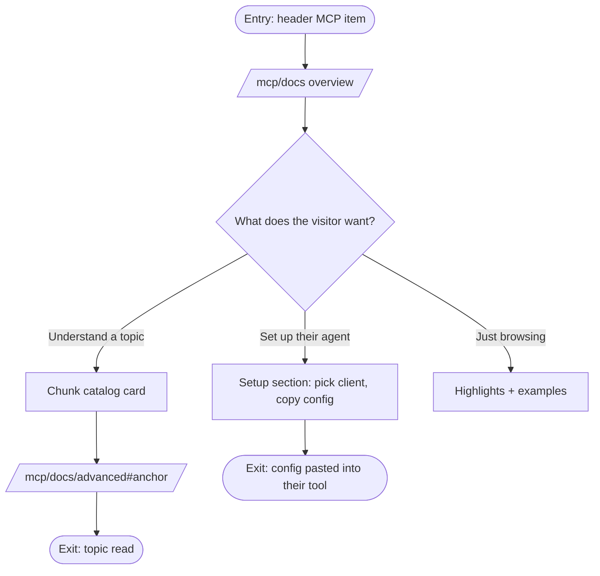
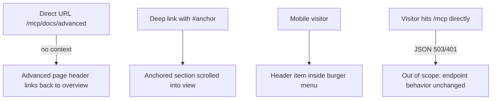

# MCP docs pages — design spec

## 1. Problem

The Explorer ships an MCP server (`/mcp`), but nothing in the product reveals it exists: the endpoint returns bare JSON, and all setup/configuration knowledge lives in repo README files that neither agent users nor deployment owners ever see. There is no place to send a person who asks "how do I connect my agent to the Explorer?".

## 2. Who this is for

| Persona                  | Context                                                                                    | What they need from this flow                                                                                   |
| ------------------------ | ------------------------------------------------------------------------------------------ | --------------------------------------------------------------------------------------------------------------- |
| AI-assisted developer    | Uses Claude Code / Cursor / Codex / Windsurf / VS Code, wants on-chain data in their agent | Copy-paste setup for their client, agent-instructions block, understanding of what `inspect_entity` returns     |
| Deployment owner / ops   | Runs an Explorer deployment, decides whether to expose MCP                                 | Enabling steps, access control (keys, IP blocklist), RPC quota isolation, telemetry knobs — and why each exists |
| Curious Explorer visitor | Landed from the header, does not know what MCP is                                          | A fast answer to "what is this and is it for me" without reading a reference manual                             |

## 3. What we're validating

**Question:** Can a visitor tell within one screen who each documentation chunk is for and what it gives them — and reach the full chunk in one click/tap?
**How we'll know:** every advanced chunk is represented on the main page by a summary (audience + benefit), and each summary leads to the concrete documentation (link to the advanced page section, or an expanding block) without dead ends.

## 4. Scope

**In scope**

1. New header entry next to Feature Gates, active-state aware.
2. Main page `/mcp/docs`: hero (what MCP gives), then the essential chunks **inline and immediately visible** (setup per client, agent instructions), then a catalog of the specific chunks — each card with "who needs it / what it gives" and a link to its advanced section.
3. Advanced page `/mcp/docs/advanced`: the concrete documentation chunks (enabling & access control, RPC configuration, preview deployments, `inspect_entity` reference, output envelope & errors, telemetry, smoke test, architecture), each anchor-addressable.
4. Tailwind styling using the Explorer's existing tokens and shared components only.

**Out of scope (stub or omit)**

1. Any change to the MCP endpoint itself (`app/mcp/route.ts`, `entity-inspector`).
2. Search integration for docs content.
3. Localization.

**Explicitly deferred to production**

1. Syntax highlighting for code blocks (plain `<pre>` styling first).

## 5. Screens

| #   | Screen                 | Route                | Reference                        | Status      |
| --- | ---------------------- | -------------------- | -------------------------------- | ----------- |
| 1   | Header entry "MCP"     | all pages (Navbar)   | Feature Gates item as pattern    | not started |
| 2   | MCP overview           | `/mcp/docs`          | mcp.solana.com landing structure | not started |
| 3   | MCP advanced reference | `/mcp/docs/advanced` | MCP-ADVANCED.md content          | not started |

## 6. Primary flow map

## 7. Alternate and failure paths

## 8. Screen states

Static content pages — no loading/empty/error states. The only stateful element is the per-client switcher in the overview's Setup section (Tabs candidate): one client's config visible at a time.

| Screen       | Loading      | Empty | Error | Partial | Success                                |
| ------------ | ------------ | ----- | ----- | ------- | -------------------------------------- |
| Header entry | n/a          | n/a   | n/a   | n/a     | active-state highlight on `/mcp/docs*` |
| Overview     | n/a (static) | n/a   | n/a   | n/a     | rendered                               |
| Advanced     | n/a (static) | n/a   | n/a   | n/a     | rendered, anchors resolvable           |

## 9. Async and system sequence

Skipped — no async behavior; all content is static.

## 10. Data

| Field                    | Type            | Source in prototype                                                                      | Notes                                                             |
| ------------------------ | --------------- | ---------------------------------------------------------------------------------------- | ----------------------------------------------------------------- |
| Page copy                | static          | `MCP.md` / `MCP-ADVANCED.md` drafts, hand-translated into TSX                            | TSX is the source of truth; the `.md` drafts stay out of the repo |
| Endpoint URL in snippets | string, dynamic | `window.location.origin` on the client; `<deployment>` placeholder as SSR/no-JS fallback | Visitor sees a copy-ready config for the deployment they are on   |
| Client configs (5 tools) | static snippets | MCP.md Setup section                                                                     | Copyable                                                          |

**Fixture rule:** placeholder data only — snippets show `<key>` / `<deployment>`, never real access keys.

## 11. Design system

**Components reused:** `Navbar` primitives (`NavbarItem`, `NavbarLink`) for the header entry; `PageContainer` for page shell; `BaseCard` / `BaseCardSection` for chunk catalog cards and doc sections; `Tabs` (candidate for the per-client setup switcher); `ExpandInfoButton` (candidate for expanding chunks); `Copyable` for config snippets; `Table` for env-var and account-kind tables.
**Components needed (new):** code block (styled `<pre>` with copy affordance — `Copyable` wraps inline values, multiline block needs a small wrapper); anchor-linked section heading for the advanced page.
**Tokens missing for this design:** none expected — text/emphasis sizes mapped onto the existing `dk`-free Tailwind palette. Known constraint: Tailwind gradient utilities don't render in this app (no `@tailwind base`), so any mcp.solana.com-style gradient accent must be an inline `linear-gradient` or be dropped.

## 12. Copy

| Location          | Text                                                                 | Notes                                        |
| ----------------- | -------------------------------------------------------------------- | -------------------------------------------- |
| Navbar item       | `MCP`                                                                | Final                                        |
| Overview title    | `Explorer MCP`                                                       |                                              |
| Overview subtitle | `Live on-chain data for coding agents`                               | Mirrors MCP.md lead                          |
| Chunk card, each  | `<chunk title>` + one line "who it's for" + one line "what it gives" | Distilled from MCP-ADVANCED.md "why" notes   |
| Advanced title    | `Advanced configuration & reference`                                 |                                              |
| All content       | English                                                              | Repo rule: everything user-facing in English |

## 13. Acceptance criteria

- [ ] Every screen in §5 exists and is reachable by clicking, not by URL editing
- [ ] Every chunk of MCP-ADVANCED.md is represented on the overview with audience + benefit, and reachable in one click
- [ ] Every terminal node in §6 and §7 is implemented
- [ ] Works at 375px and 1280px (header entry included in the mobile burger)
- [ ] Keyboard-navigable; visible focus states; anchors reachable by URL
- [ ] `pnpm lint`, `pnpm typecheck`, `pnpm test` pass
- [ ] Only design tokens used — no hardcoded colors or spacing; no `dk`-tagged legacy styles
- [ ] The question in §3 can be tested on a preview URL

## 14. Open questions

All resolved 2026-08-12:

| #   | Question                           | Decision                                                                                                                               |
| --- | ---------------------------------- | -------------------------------------------------------------------------------------------------------------------------------------- |
| 1   | Chunk presentation on the overview | Essentials (setup, agent instructions) inline and immediately visible; specific chunks as cards linking to `/mcp/docs/advanced#anchor` |
| 2   | Content source                     | Hand-written TSX; `MCP.md`/`MCP-ADVANCED.md` remain uncommitted drafts                                                                 |
| 3   | Navbar label                       | `MCP`                                                                                                                                  |
| 4   | Cluster-aware paths                | Yes — `useClusterPath`, consistent with Feature Gates and Inspector                                                                    |
| 5   | Deployment URL in snippets         | Dynamic `window.location.origin`; `<deployment>` placeholder as SSR/no-JS fallback                                                     |

## 15. Changelog

| Date       | Change                                                                                                                          | Why                                          |
| ---------- | ------------------------------------------------------------------------------------------------------------------------------- | -------------------------------------------- |
| 2026-08-12 | Initial draft                                                                                                                   | Bootstrap for HOO-1081 before implementation |
| 2026-08-12 | Resolved all §14 questions; overview keeps essentials inline, specifics link to advanced; TSX content; dynamic host in snippets | Interview with owner                         |
