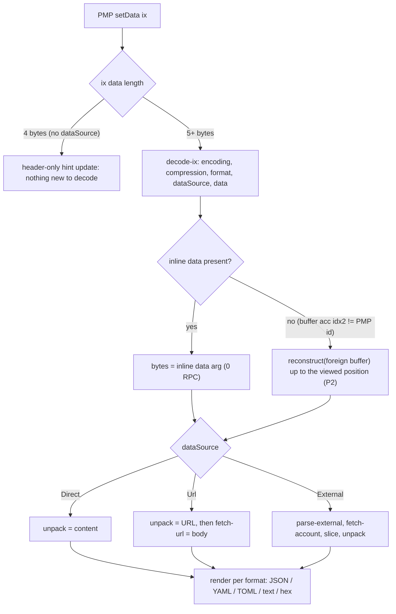
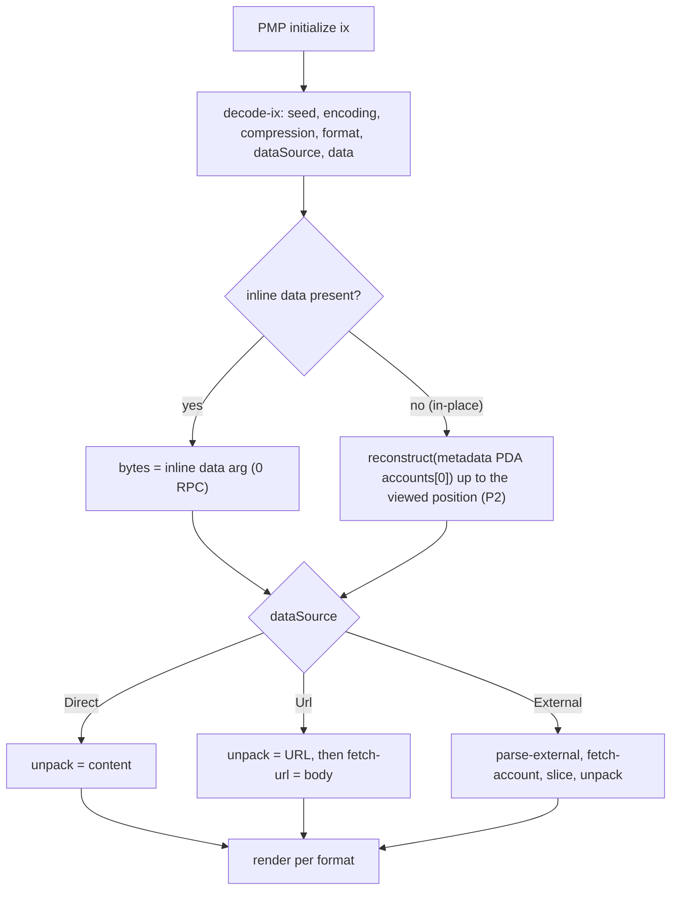
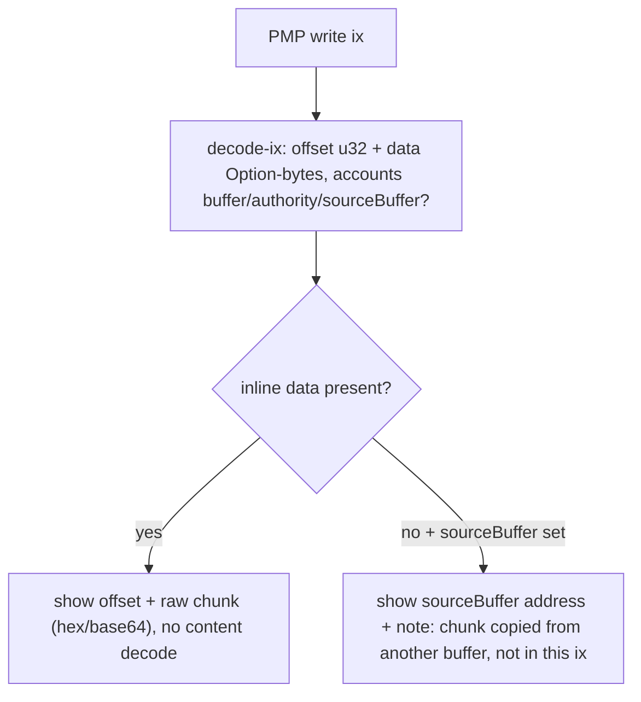

# Flows: PMP buffer-content decode

High-level flows for `setData`, `initialize`, and `write`. Companion to `design.md` (§3-§5).

## The two-stage model (key insight)

Decoding is two orthogonal stages. Where the bytes come from is independent of how they are interpreted, so the
many "cases" are just `stage 1 x stage 2`:

- Stage 1 - OBTAIN the `data` bytes: inline arg (0 RPC) OR reconstruct a buffer/PDA (P2, behind the Decode button).
- Stage 2 - INTERPRET per `dataSource`: `Direct` (bytes are the content), `Url` (bytes are a URL, then fetch),
  `External` (bytes are a pointer, then fetch an account).

`encoding`/`compression` apply where the payload really lives: to the content for `Direct`, to the URL pointer for
`Url`, and to the FETCHED account bytes for `External` (the `ExternalData` pointer itself is stored plain). `format`
always applies to the final content that gets rendered.

In practice only `Direct` uses a buffer - a URL string or an `ExternalData` pointer (~40B) is tiny and fits inline.
The `Url`/`External` + buffer combinations are drawn for completeness but are unused on-chain.

### Step primitives (used in the lists below)

- `decode-ix` - decode raw ix bytes with the typed decoder (`getSetData`/`getInitialize`/`getWrite...DataDecoder`)
  into config (`encoding`, `compression`, `format`, `dataSource`) + `data` (Option bytes).
- `unpack(bytes)` - `uncompress(compression)` then `decode(encoding)` into a string. This is `unpackDirectData` for
  transaction-bounded INLINE bytes. Buffer-sourced (P2) and fetched External (P3) bytes go through the
  output-bounded inflate instead, then the same `decodeData` encoding step (`design.md` §3 and §6).
- `reconstruct(acc)` - `getSignaturesForAddress` + `getTransaction` (or the Triton `getTransactionsForAddress` fast
  path), replay `write` chunks offset-patched in execution order up to the viewed transaction's EXECUTION POSITION
  (slot, transactionIndex, intra-tx ix index), into bytes (P2). Runs behind the Decode button. A same-slot
  transaction the fallback cannot order against the viewed one is excluded and flagged. It also DERIVES
  `data_length` from BOUNDS - a lower bound from a forward size replay, an upper bound from the account's
  rent-exempt balance - and reports `complete` only where the two meet with clean coverage, so a pruned tail can
  neither shrink the target nor pass as complete (`design.md` §4.2). When the viewed tx is the metadata account's
  current state, a live read of that account supersedes this step entirely.
- `parse-external(bytes)` - decode the exactly-40-byte `ExternalData{address, offset, length}` pointer with
  `unpackExternalData` (plain struct, no unpack).
- `fetch-account(address)` - `getAccountInfo` with a bounded `dataSlice`, then slice `[offset, offset+length)` (whole
  account when `length` is absent, which is how an all-zeroes length field decodes).
- `fetch-url(url)` - `fetch(url)` then read text, guarded (http(s)-only, size cap, timeout, prefer server proxy).
- `render(str, format)` - JSON pretty-print / YAML / TOML / text verbatim / hex.

Note: the SDK's `unpackAndFetchData` looks like it encapsulates the whole of stage 2, but only its `Direct` branch
is usable. Its `Url` fetch is unguarded and its `External` branch fetches unsliced, throws on a missing account, and
inflates unbounded, so `fetch-account`/`fetch-url` are hand-rolled (see `design.md` §2). Stage 1 buffer
reconstruction is ours to build either way.

---

## 1. `setData`

One-line action lists:

- Direct + data arg: `decode-ix` -> `unpack(data)` -> `render`. 0 RPC.
- Direct + buffer acc: `decode-ix` -> `reconstruct(buffer)` -> `unpack` -> `render`. Behind Decode button.
- External + data arg: `decode-ix` -> `parse-external(data)` -> `fetch-account` -> `unpack(slice)` -> `render`.
  Behind Decode.
- External + buffer acc: `decode-ix` -> `reconstruct(buffer)` -> `parse-external` -> `fetch-account` ->
  `unpack(slice)` -> `render`. Rare/unused.
- Url + data arg: `decode-ix` -> `unpack(data)` = URL -> `fetch-url` -> `render(body, format)`. Behind Decode, guarded.
- Url + buffer acc: `decode-ix` -> `reconstruct(buffer)` -> `unpack` = URL -> `fetch-url` -> `render`. Rare/unused.
- Header-only (4-byte ix data, no `dataSource` byte): read the three hints directly, show them, nothing to decode.
  The typed `setData` decoder cannot decode this shape, so guard on the length before calling it.

---

## 2. `initialize`

Identical to `setData`, with ONE difference in stage 1: `initialize` has no foreign buffer. When `data` is empty
the payload was pre-written in place, so reconstruction targets the metadata PDA itself (`accounts[0]`).

One-line action lists:

- Direct + data arg: `decode-ix` -> `unpack(data)` -> `render`. 0 RPC.
- Direct + in-place: `decode-ix` -> `reconstruct(metadataPda)` -> `unpack` -> `render`. Behind Decode button.
- External + data arg: `decode-ix` -> `parse-external(data)` -> `fetch-account` -> `unpack(slice)` -> `render`.
  Behind Decode.
- External + in-place: `decode-ix` -> `reconstruct(metadataPda)` -> `parse-external` -> `fetch-account` ->
  `unpack(slice)` -> `render`. Rare/unused.
- Url + data arg: `decode-ix` -> `unpack(data)` = URL -> `fetch-url` -> `render(body, format)`. Behind Decode, guarded.
- Url + in-place: `decode-ix` -> `reconstruct(metadataPda)` -> `unpack` = URL -> `fetch-url` -> `render`. Rare/unused.

---

## 3. `write`

A `write` is a fragment with NO `encoding`/`compression`/`format`, so it is never decoded to a document on the
instruction page. Show only what this instruction carries.

One-line action lists:

- Inline chunk: `decode-ix` -> show `offset` + raw chunk (hex/base64). 0 RPC. No content decode.
- From sourceBuffer (data empty, idx2 set): `decode-ix` -> show `sourceBuffer` address + note. No reconstruction here.

The same shape matters inside P2 replay: such a `write` copies the whole source buffer body, so its bytes are not in
the transaction and the range it covers is unrecoverable - `[offset, dataLength)` when a length is derived, an
unbounded tail from `offset` when none is, never a zero-length range. Reconstruction marks it, it does not patch it.
