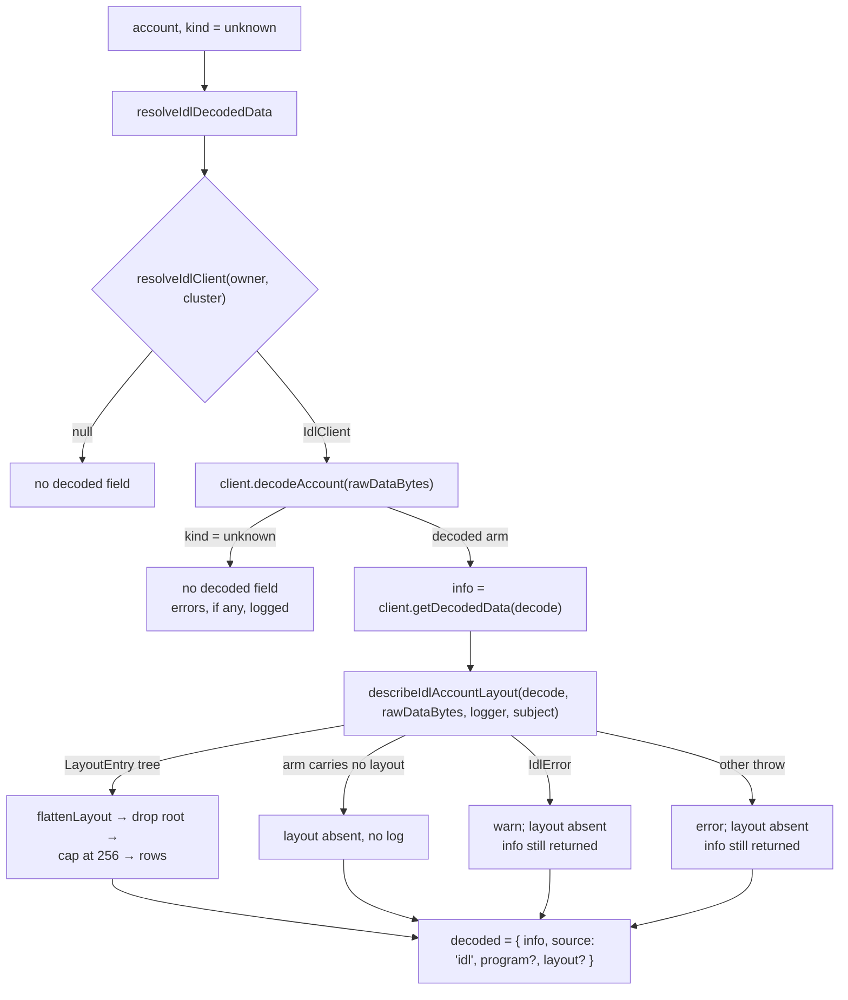

# mcp-account-layout

## Purpose

Let a caller of `inspect_entity` relate an account's raw bytes to its decoded payload. An unknown-kind
account whose owner program publishes an IDL already returns `decoded.info`; `decoded.layout` says which
byte range each of those fields occupies, in the schema's own vocabulary, with the program's own docs.

## Architecture

## ADDED Requirements

### Requirement: The layout is a flat list of payload locations

`decoded.layout.fields` SHALL contain one row per layout entry of the decoded payload — named fields
plus the container bodies and the container elements they nest in — each carrying the dot `path` that
reads that value out of `decoded.info`, the byte `offset` and `size` it occupies in the account's raw
data, and the `kind` of the schema node it resolved to. An element that is not a container stays a value
on its array, so an array of numbers, pubkeys, strings or variant-only enums is one row.

Every `path` SHALL appear at most once, so a row is identified by its path. A row SHALL carry `format`
when the node declares one, and `docs` when the IDL declares doc comments for the field. Rows MUST NOT
repeat the decoded value — `decoded.info` already carries it under the same path.

A row's range covers the codec framing the schema does not name, so `size` is the field's extent rather
than its payload's. Where the framed member has a row of its own, that framing is the gap between a
parent's range and its children's.

The root entry MUST be absent: its path is empty, so it addresses no value of its own. A schema that
names no field therefore leaves no row at all, and `decoded.layout` MUST then be absent rather than
empty — an empty row list tells a caller no more than no layout does.

#### Scenario: Field rows describe the byte ranges

- **WHEN** an unknown-kind account decodes through an IDL declaring `authority: pubkey` then `total: u32`
- **THEN** `decoded.layout.fields` MUST be `[{ path: 'authority', offset: 0, size: 32, kind: 'publicKeyTypeNode', docs: [...] }, { path: 'total', offset: 32, size: 4, kind: 'numberTypeNode', format: 'u32' }]`

#### Scenario: Nested field path reads the payload

- **WHEN** a field holds a vec of structs
- **THEN** a row for a field inside the first element MUST use the dot path through that index, e.g. `receipts.0.productName`
- **AND** reading that path out of `decoded.info` MUST yield the value the row describes

#### Scenario: Schema that names no field

- **WHEN** the payload's schema declares no field, leaving the root entry alone
- **THEN** `decoded` MUST NOT carry a `layout` key
- **AND** nothing MUST be logged, since an empty layout is not a failure

### Requirement: A long layout is capped and says so

`decoded.layout.fields` SHALL contain at most 256 rows. When the payload names more, the layout SHALL
report the number of dropped rows as `omitted`, and MUST NOT present the surviving prefix as complete.

The kept rows are a depth-first prefix, so a large nested array early in the account can spend the cap
and hide the account's own later fields. `omitted` is the only signal that happened.

`omitted` MUST be absent when nothing was dropped.

#### Scenario: Truncated layout reports the remainder

- **WHEN** an account names 300 fields
- **THEN** `decoded.layout.fields` MUST have 256 rows
- **AND** `decoded.layout.omitted` MUST be 44

#### Scenario: Complete layout carries no omitted count

- **WHEN** an account names fewer fields than the cap
- **THEN** `decoded.layout` MUST NOT carry an `omitted` key

### Requirement: The layout never costs the caller its decoded data

Building the layout SHALL be best-effort: a failure MUST leave `decoded.info`, `decoded.source` and
`decoded.program` unchanged, and omit only `decoded.layout`. Every step that turns the walk into rows —
flattening, dropping the root, capping — SHALL sit inside that guarantee, so no part of it can fail the
whole tool call.

A failure SHALL be logged with the account it was built for, so an IDL-specific failure is reproducible
from the log. A typed `IdlError` is a schema the walk cannot describe and SHALL be logged as a warning;
any other throw is a defect and SHALL be logged as an error. An arm that carries no layout at all is a
normal outcome and MUST NOT be logged.

Adding the field MUST NOT change when `decoded` appears at all — an account whose IDL cannot decode it
resolves without a `decoded` field exactly as before.

#### Scenario: Layout walk fails

- **WHEN** the layout walk throws for a decode the client produced
- **THEN** the reply MUST still carry `decoded.info` and `decoded.source`
- **AND** `decoded` MUST NOT carry a `layout` key
- **AND** the logger MUST record a warning naming the account address and owner

#### Scenario: Arm that carries no layout

- **WHEN** the decode is an arm `getDecodedLayout` does not serve
- **THEN** `decoded` MUST NOT carry a `layout` key
- **AND** the logger MUST NOT record anything

#### Scenario: Account the IDL cannot decode

- **WHEN** `client.decodeAccount` returns the unknown arm
- **THEN** the entity payload MUST NOT carry a `decoded` field
- **AND** the errors that arm carries MUST be logged when it carries any, since the reply cannot show them
