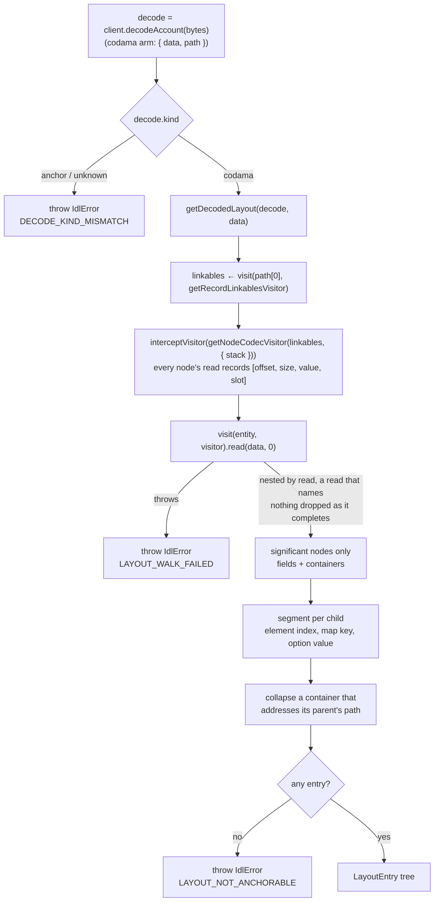

# idl-byte-layout

## Purpose

Pair a decoded account or instruction payload with the bytes it came from: for every field the IDL
names, the exact `[offset, offset + size)` the decoder consumed, plus the resolved schema node, the
decoded value, and the program's own doc comments. It is the offset dimension `getDecodedEntries`
cannot carry, and it is what a byte inspector needs to highlight a hex dump and what an MCP tool needs
to describe a layout to something that cannot see one.

## Architecture

`read`, not `decode`: kit builds a codec's `decode` over its own `read`, closing over the
un-instrumented one, so the outermost node would never record its own range.

## ADDED Requirements

### Requirement: Ranges are measured by the decoder

`getDecodedLayout` SHALL obtain every byte range by instrumenting the codec pipeline — each node's
`read` records the span it consumed during a single read of the payload — and MUST NOT compute ranges
by summing node sizes alongside the engine.

Codama owns the size rules (length prefixes, size prefixes, sentinels, pre/post offsets, hidden
prefixes, fixed and remainder and zeroable options). A parallel implementation of those rules would be
free to disagree with the engine on exactly the layouts this capability exists to explain.

#### Scenario: Published layout is reproduced

- **WHEN** an SPL Token account's 165 bytes are decoded through the program's Codama root
- **THEN** the layout MUST report `mint` at 0+32, `owner` at 32+32, `amount` at 64+8, `delegate` at
  72+36, `state` at 108+1, `isNative` at 109+12, `delegatedAmount` at 121+8, and `closeAuthority` at
  129+36

#### Scenario: Variable-size payload resolves element by element

- **WHEN** an account holds a `Vec` of structs whose fields include a size-prefixed string
- **THEN** each element MUST carry its own entry with its own range
- **AND** each element's fields MUST carry ranges inside that element's range

#### Scenario: Bytes the decode cannot be replayed against

- **WHEN** `data` is too short for the schema the decode matched
- **THEN** `getDecodedLayout` MUST throw `IdlError` with code `IDL_ERROR__LAYOUT_WALK_FAILED`
- **AND** the error's context MUST carry `dataLength`

#### Scenario: Payload with no container to anchor a range to

- **WHEN** the schema reads the whole payload through a node that is neither a field nor a container
- **THEN** `getDecodedLayout` MUST throw `IdlError` with code `IDL_ERROR__LAYOUT_NOT_ANCHORABLE`
- **AND** the error MUST NOT report the bytes as unreplayable, because the decode itself succeeded

### Requirement: Containment comes from read nesting

A read SHALL claim the reads that occurred inside its own call, and containment MUST NOT be derived by
comparing byte ranges.

A zero-size read shares the offset of the read that follows it, so a range test cannot tell a
zero-size sibling from a child. Nesting by call also records each read's position among its parent's
reads, which is what lets an element keep the payload's index when an earlier element describes
nothing.

#### Scenario: Zero-size field stays a sibling

- **WHEN** a struct declares a zero-size field before another field
- **THEN** both MUST be siblings under the struct, in byte order
- **AND** the zero-size field MUST NOT appear beneath the field that follows it

#### Scenario: Trace stays proportional to the schema

- **WHEN** an account holds a single array of 65_536 scalars
- **THEN** the layout MUST contain one entry for that array
- **AND** the walk MUST NOT cost time proportional to the square of the element count

### Requirement: Entries name fields and containers, not codec framing

The layout tree SHALL contain one entry per named struct field and per container body (struct, array,
set, tuple, map, data enum), and MUST NOT contain entries for the framing the codec reads but the
schema does not name. A variant-only enum is not a container here: the codec decodes it to an index, so
it is a value like any scalar.

Where a framed member has an entry of its own, the framing remains discoverable as an unclaimed range
between the parent's range and its children's. Where it does not — a size-prefixed string, an option of
a scalar, a scalar enum — the framing stays inside the entry's own range, so `size` is the field's
extent rather than its payload's. Emitting an entry per codec read would place an unnamed twin on every
non-scalar path and turn a `[Tick; 60]` account into roughly two thousand rows the schema never named.

#### Scenario: Count prefix is a gap

- **WHEN** a field holds a prefixed-count array
- **THEN** the field's entry MUST span the prefix and the elements together
- **AND** the first element's entry MUST begin after the prefix, leaving the prefix unclaimed

#### Scenario: Enum discriminant is a gap

- **WHEN** a field holds a data-carrying enum
- **THEN** the field's entry MUST span the discriminant and the variant payload together
- **AND** the variant's own members MUST begin after the discriminant

#### Scenario: Leaf framing stays inside the leaf's range

- **WHEN** a field holds a size-prefixed string
- **THEN** the field MUST be a single entry whose range covers the prefix and the characters
- **AND** no gap MUST be reported for the prefix, because no child claims the characters

#### Scenario: Scalar array is one entry

- **WHEN** a field holds an array of scalars
- **THEN** the field MUST be a single entry with no children
- **AND** its `value` MUST be the decoded array

#### Scenario: Variant-only enum is a value, not a container

- **WHEN** a field holds an array of an enum whose every variant carries no data
- **THEN** the field MUST be a single entry with no children, as for an array of scalars
- **AND** that enum used as a field of its own MUST still carry an entry, resolved to the enum node

#### Scenario: Container level is not duplicated

- **WHEN** a container addresses the same payload location as its parent entry
- **THEN** exactly one entry MUST represent both
- **AND** the surviving entry MUST be the parent, which carries the name and docs

### Requirement: Entries resolve the schema and carry the IDL's docs

Every entry SHALL expose the resolved type node — size wrappers penetrated and defined-type links
followed, as `getDecodedEntries` resolves a leaf's node — so consumers render by `node.kind` rather
than by the value's JS shape. Resolution SHALL stop at the first node that owns a value of its own: a
single-member container reads exactly its member's bytes, and reporting the member's type as the
field's would contradict the field's own children.

Each entry SHALL expose the doc comments the IDL declares for the field, and `[]` when it declares
none, so the program's own prose is the explanation and no second source is needed.

#### Scenario: Field docs travel from the IDL

- **WHEN** a struct field declares doc comments in the IDL
- **THEN** the field's entry `docs` MUST equal those comments

#### Scenario: Wrappers and links resolve

- **WHEN** a field's type is a size-prefixed string, or a link to a defined struct
- **THEN** the entry's `node` MUST be the string node, or that struct node, respectively

#### Scenario: Single-member container keeps its own type

- **WHEN** a field's type is a struct whose only member links a scalar
- **THEN** the field's entry `node` MUST be the struct node, not the scalar the member links

### Requirement: Paths address the decoded payload

Every entry's `path` SHALL address that entry's own value inside the decoded payload, in the spelling
`joinPath` accepts. Reading the path out of the decode MUST yield the entry's `value`, and no two
entries MUST share a path.

Segments are therefore the payload's own: an element's index as the payload orders it, a map's key as
the payload keys it, and `value` for an option's payload, since that is where the decode keeps it. This
diverges from `getDecodedEntries`, which unwraps an option transparently — correct for a leaf-value
walk, and unusable for a consumer that holds the payload rather than the schema.

The root entry's path SHALL be empty and its range SHALL span the bytes the schema read, which is fewer
than `data.length` for a reallocated or extension-bearing account.

#### Scenario: Nested element path

- **WHEN** a field named `receipts` holds structs with a field named `productName`
- **THEN** the first element's `productName` entry MUST have path `['receipts', 0, 'productName']`

#### Scenario: Element index survives an element that describes nothing

- **WHEN** an array holds options and the second one is `None`
- **THEN** the third element's entry MUST use index 2
- **AND** no entry MUST use index 1

#### Scenario: Option payload is addressed under `value`

- **WHEN** a field holds an option of a struct that decoded to `Some`
- **THEN** the struct's entry MUST have the field's path followed by `value`
- **AND** a `None` option MUST contribute no payload entry at all

#### Scenario: Map value is addressed by its key

- **WHEN** a field holds a map of structs
- **THEN** each value's entry MUST have the field's path followed by that entry's decoded key
- **AND** the keys themselves MUST NOT earn entries

### Requirement: Accounts and instructions use one route

`getDecodedLayout` SHALL accept both an account decode and an instruction decode, and MUST throw
`IDL_ERROR__DECODE_KIND_MISMATCH` for any arm other than the codama arm — the same contract
`getDecodedEntries` and `unwrap` apply.

#### Scenario: Instruction arguments map like account fields

- **WHEN** an instruction decode is passed with the instruction's data
- **THEN** each argument MUST carry a range, the discriminator included

#### Scenario: Non-codama arm

- **WHEN** the decode is the anchor arm or the unknown arm
- **THEN** `getDecodedLayout` MUST throw `IdlError` with code `IDL_ERROR__DECODE_KIND_MISMATCH`
