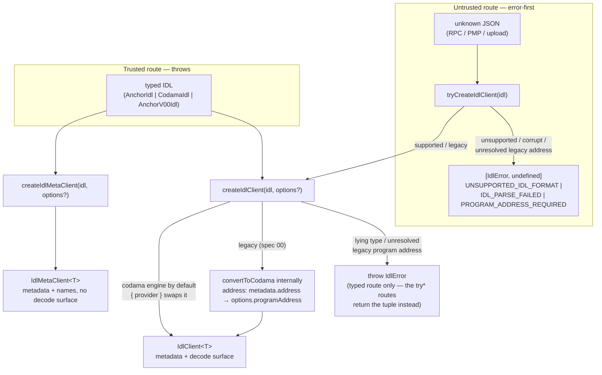
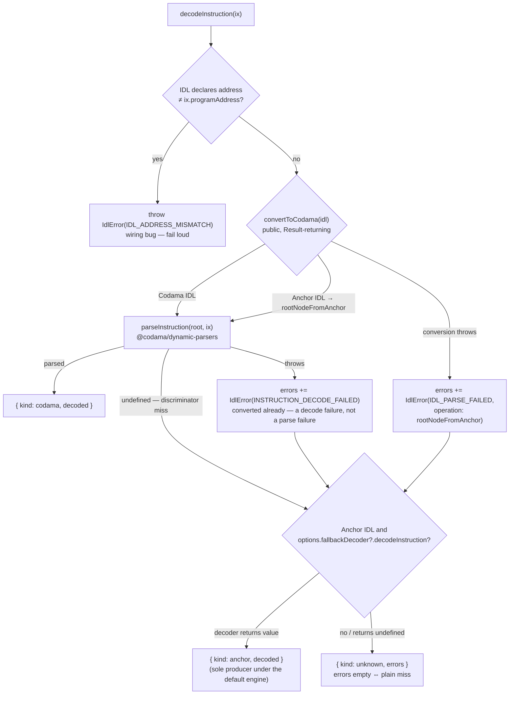

# @explorer/idl-decode — Design

One typed, standard-aware client over a program IDL: modern Anchor (>= 0.30) and Codama roots decode
through a single pipeline; legacy pre-0.30 Anchor converts at creation (program address required).
Decode results are discriminated unions narrowed statically per standard — a Codama client cannot
even express an anchor-arm handler. The README documents the consumer API; this file records the
shape and the WHY.

## Client flow

Construction — untrusted input goes error-first, typed input throws; both land on the same client:

Instruction decode — the default codama engine; under it the anchor arm exists only via the injected escape hatch:

`decodeAccount(data)` runs the same pipeline (`parseAccountData`, no address check, same escape hatch).
Handler maps are total by type; a runtime miss throws `MISSING_DECODE_HANDLER` — the bypassed-types tripwire.
`getDecodedData` asymmetry: the codama arm yields the engine result's `data`, the anchor arm the injected decoder's whole value.

## Decisions

- **Codama-normalized single pipeline** — anchor converts (`@codama/nodes-from-anchor`), one engine (`@codama/dynamic-parsers`) decodes everything; two engines would be double maintenance for the same bytes.
- **Anchor arm = escape hatch only** — under the default codama engine the injected `fallbackDecoder` is the sole producer of `{ kind: anchor }` (a swapped provider may return it directly); its payload stays `unknown` so consumers never couple to a library guess; bypassed pipeline errors survive in `recoveredFrom`.
- **Legacy pre-0.30 converts at creation** — recognized (`isLegacyAnchorIdl`), normalized internally via `convertToCodama` (nodes-from-anchor handles both specs) into a codama client; the program address must resolve (IDL `metadata.address` → `options.programAddress` → typed `PROGRAM_ADDRESS_REQUIRED`) because real `anchor build` 0.29 output declares none. Consumer-owned decoders remain for IDLs conversion cannot handle.
- **Errors are values** — error-first `Result` tuples; decode failures ride the `unknown` arm as coded `IdlError`s (plain miss ⇔ `errors: []`); codes follow `@codama/errors`: stable numbers, typed context, throws split by pipeline stage.
- **Guards over a `standard` field** — `isAnchorStandard`/`isCodamaStandard` narrow the client; a string field invites untyped branching.
- **Codama payloads typed from the engine** — `NonNullable<ReturnType<typeof parseInstruction>>`, never a hand-maintained mirror.
- **Default engine rides the main entry** — ease of use over an engine-free core; the trade: every main-entry consumer loads the codama pipeline. Names-only consumers get `createIdlMetaClient` instead.
- **Heavy machinery behind subpaths** (`./fetch`, `./anchor`, `./codama`) — an entry earns its keep only when it guards a dependency subtree some real consumer profile must never load; tree-shaking alone does not protect plain-Node ESM consumers.
- **Parsed-data only** — rendering, hooks, ErrorBoundaries are consumer layers; unknown programs render by schema node (`getDecodedEntries`), never by value shape.
- **Byte ranges are measured, not computed** — `getDecodedLayout` instruments every node's `read` (`interceptVisitor` over the codec visitor) and reads the payload once, so a range is what the decoder consumed. Walking the schema and summing sizes instead would be a second implementation of every size rule (prefixes, sentinels, offsets, fixed options) free to disagree with the engine on exactly the layouts a byte inspector exists to explain. The cost is a second read pass over the bytes and a dependency on codama's codec-visitor internals, both bounded and covered by real-IDL tests (published SPL Token offsets are the oracle).
- **Containment comes from read nesting, not from comparing ranges** — each instrumented `read` claims the reads that happened inside its own call. Ranges alone cannot express it: a zero-size field shares the next field's offset, so a range test hands it to the wrong parent. Nesting by call also gives every read its position among its parent's reads, which is what keeps an element's index the payload's own when a `None` element describes nothing.
- **Layout entries name fields and containers, not codec framing** — a length prefix, an enum discriminant or an option tag surfaces as a gap between a parent's range and its children's where the framed member has an entry, and stays inside the entry's own range where it does not (a size-prefixed string is one range). Non-container array elements stay values on their array — a variant-only enum among them, split from a data enum by the engine's own `isScalarEnum`, so the layout draws the line exactly where the codec does. Emitting an entry per codec read would put unnamed twins on every non-scalar path and turn a `[Tick; 60]` account into ~2000 rows the schema never named; recording one *trace* per read made the walk quadratic in a big array's element count, so a read that can name nothing is dropped as it completes and only its position survives.
- **A layout path addresses the payload, not the schema** — reading an entry's path out of the decode yields that entry's value, so an option's payload sits under `value` and a map's values under their keys. `getDecodedEntries` unwraps options instead, which is right for a leaf-value walk and wrong here: a consumer holding the reply has the payload, not the schema, and a path it cannot follow is worse than no path.
- **Layout rides the main entry** — it guards no dependency subtree the main entry does not already load (`@codama/dynamic-parsers` pulls `@codama/dynamic-codecs` in regardless), so by the subpath criterion above it does not earn one; it sits beside `getDecodedEntries`, its offset-free sibling.
- **Real-artifact tests** — fixture programs build genuine IDLs (sha256-true discriminators) and mainnet snapshots are committed; CI never invokes the Rust/Anchor toolchain (regeneration is manual — DEVELOPMENT.md).

## Non-Goals

- IDL sources beyond the two on-chain legs (PMP `idl` metadata, Anchor IDL PDA) — registries and caches plug in as consumer-supplied fetchers.
- The Anchor-rich decode path (events, nested account groups) — a future seam, not this core.
