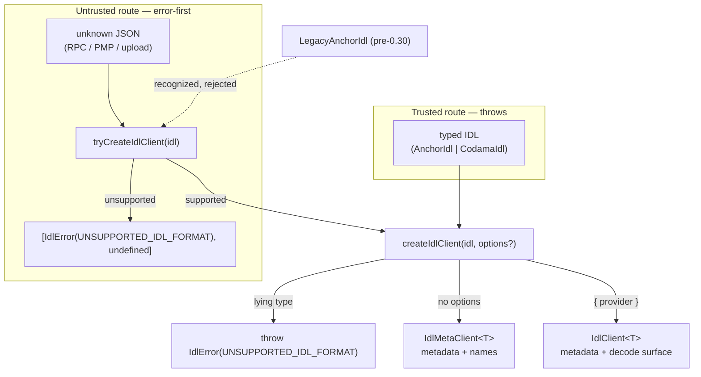
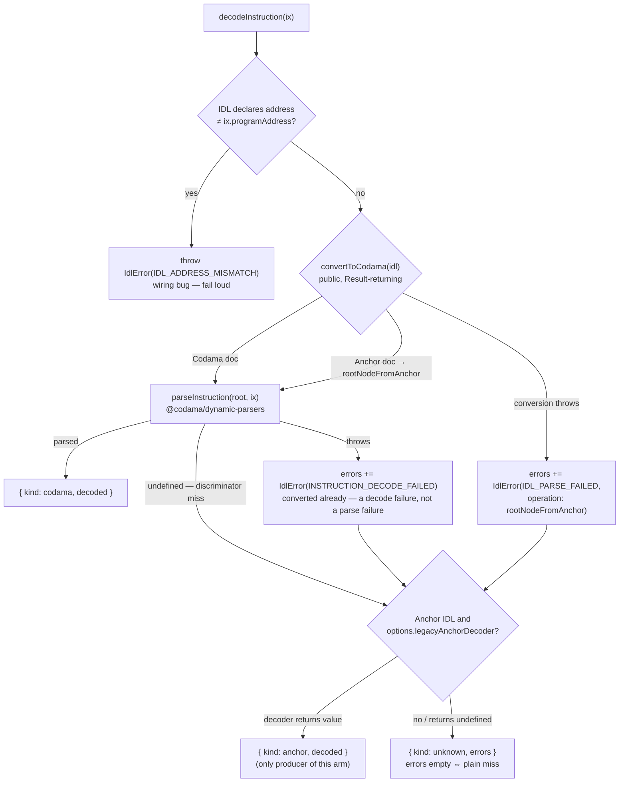

# @explorer/idl — Design

The package wraps one IDL into a client whose decode results are discriminated unions narrowed statically per standard. This document records the architecture and the reasoning behind it so consumers build on a documented contract. Everything below is shipped code (`src/`), not a plan.

## Why

Decoding a program's instruction and account data by its IDL is the core problem, and IDLs arrive in more than one standard: modern Anchor (>= 0.30, `metadata.spec`) and Codama root nodes (as the program-metadata program stores them), plus a third pre-0.30 legacy Anchor shape that must be recognized but not decoded. Each standard has to be handled on its own terms. This package is one typed, standard-aware core that turns any supported IDL into decoded data, with compile-time guarantees about which decode outcomes each standard can produce.

## What the package delivers

- Standard detection, typed client, codama-primary decode pipeline, discriminator-based instruction naming, coded error family (`@codama/errors` pattern, error-first `Result` tuples).
- Client API: `createIdlClient<T>` (throws on lying types) / `tryCreateIdlClient` (error-first for untrusted input); decode methods return discriminated unions that narrow statically per standard — a Codama client cannot even express an anchor-arm handler. A standalone `getDecodedData(decode)` returns the payload regardless of which arm produced it (undefined for the unknown arm); `decodeInstructionData` / `decodeAccountData` collapse decode + payload into one error-first `Result`, with an optional `kind` argument that asserts the expected arm (`DECODE_KIND_MISMATCH` otherwise).
- Escape hatch: an injectable `legacyAnchorDecoder` option for modern Anchor IDLs the conversion route cannot handle — never bundled into the package.
- Legacy pre-0.30 IDLs: `isLegacyAnchorIdl` recognizes them; the client rejects them at compile time and runtime — consumers decode them with their own decoder.

Capabilities:

- `idl-detection`: recognize and narrow unknown input into modern Anchor, Codama, or legacy Anchor; expose standard/version metadata helpers.
- `idl-client`: typed client construction over one IDL — program metadata reads, handler-map decode dispatch, static narrowing per standard, injectable legacy decoder seam.
- `idl-decoding`: single codama-normalized decode pipeline for instructions and accounts — address-mismatch fail-loud, conversion + parse error collection, miss-vs-failure semantics of the `unknown` arm.
- `instruction-naming`: discriminator-prefix name resolution (Anchor byte arrays, Codama constant int fields) with longest-prefix matching.

## Core ideas

- *Errors are values, not throws* — fallible operations return the error-first `Result` tuple (`[IdlError, undefined] | [undefined, value]`), and decode failures ride the `unknown` arm as coded `IdlError`s; the consumer decides severity, the package never logs.
- *Legacy variants are the consumer's decoder, not ours* — the client accepts a custom decoder via options (`legacyAnchorDecoder`) for IDLs the built-in conversion route cannot handle; the package ships no Borsh fallback of its own.
- *User-facing client, easy configuration* — one IDL in, working metadata client out (names, address, detection): no flags, no options. Decoding is an explicit engine choice (`{ provider }`), so processes that never decode — name-only MCP tools — never load an engine; `createCodamaIdlClient` from `@explorer/idl/codama` is the one-import path for default-engine users.
- *Engines live behind subpath entries* — the main entry is engine-free; `./codama` ships the default engine, `./anchor` the conversion (and the future Anchor-rich provider). Subpath threshold: an entry earns its keep only when it guards a runtime dependency subtree not acceptable in every consumer (size or policy — web3.js) AND a real consumer profile never calls it; tree-shaking alone does not protect plain-Node consumers (MCP), whose ESM loader executes the whole import graph.

## Client flow

Construction — untrusted input goes through the error-first route, typed input through the throwing route; both land on the same client:

Instruction decode — single codama-normalized pipeline; the anchor arm exists only via the injected escape hatch:

`decodeAccount(data)` runs the same pipeline via `parseAccountData` — no address check, no legacy fallback; a throw collects `ACCOUNT_DECODE_FAILED` (with `dataLength` + standard) into the `unknown` arm. The handler-map overloads dispatch any decode over `{ anchor | codama | unknown }`; totality is enforced by the types (a Codama client's map has no `anchor` key), and a runtime miss throws `MISSING_DECODE_HANDLER` (bypassed-types tripwire). For consumers that don't care which arm produced the payload, the standalone `getDecodedData(decode)` returns it arm-agnostically (undefined for the unknown arm; note the asymmetry — the codama arm yields the engine result's `data`, the anchor arm the injected decoder's whole value).

The client is not the only surface: `convertToCodama`, the standalone `decodeInstructionWithIdl`/`decodeAccountWithIdl`, and the name-table helpers (`buildInstructionNameTable`/`buildInstructionNameResolver`/`matchInstructionName`) are exported for consumers composing their own flow.

## Goals / Non-Goals

**Goals:**

- One decode engine for both standards; typed results that make impossible arms unwritable per standard.
- Parsed-data only — the package returns data; rendering, hooks, ErrorBoundaries are consumer-side layers.
- Error-as-data: decode failures ride the `unknown` arm as coded `IdlError`s; consumers map codes to their own severities/UI.
- Real-artifact tests: fixture Anchor programs build genuine IDLs so discriminators and shapes are sha256-true, not invented; tracked mainnet snapshots (`let-me-buy` Anchor + PMP, `tokenkeg` PMP) pin the dual-standard behavior on real IDLs.

**Non-Goals:**

- IDL fetching/resolution — the package decodes an IDL it is handed; discovering or fetching it is the consumer's job.
- The Anchor-rich decode path — events, nested account groups via anchor `Program` — is a future seam, not part of this core.
- Legacy pre-0.30 decoding — consumers own it; the package only recognizes the shape.

## Decisions

- **Codama-normalized single pipeline** — Anchor IDLs convert via `@codama/nodes-from-anchor`, then one engine (`@codama/dynamic-parsers`) decodes everything. Alternative (two engines, anchor-first) rejected: double maintenance for the same bytes. Converted IDLs keep byte-array discriminator naming: `codamaDiscriminator` resolves the `fieldDiscriminatorNode` (bytes default) the conversion emits, alongside constant int fields and 64/128-bit formats.
- **Anchor arm = escape hatch only** — `legacyAnchorDecoder` is injected via options, never bundled, and is the sole producer of `{ kind: anchor }`. A successful rescue keeps any bypassed pipeline errors in `recoveredFrom` rather than dropping them. Keeps the package free of consumer-specific Borsh fallbacks.
- **`unknown` arm carries `errors: IdlError[]`** — a discriminator miss is a plain miss (`errors: []`), a pipeline failure carries coded errors (the length convention is documented in the README's error contract).
- **Guards over a `standard` field** — `isAnchorStandard`/`isCodamaStandard` narrow `IdlClient<T>`; a string field would invite untyped branching.
- **Codama payloads typed from the engine** (`NonNullable<ReturnType<typeof parseInstruction>>`); Anchor payloads stay opaque `unknown` until a future Anchor-rich provider defines the real shape — consumers cannot couple to a guess.
- **Errors follow `@codama/errors`** — stable numeric codes (never renumbered), context required exactly when a code declares one, error-first `Result` tuples. Instruction-pipeline throws split by stage: a conversion throw maps to `IDL_PARSE_FAILED`, a post-conversion parse throw to `INSTRUCTION_DECODE_FAILED`; account throws map to `ACCOUNT_DECODE_FAILED`. `DECODE_KIND_MISMATCH` (9) backs the optional `kind` assertion on `decodeInstructionData`/`decodeAccountData`. Codes 2/8 (`IDL_FETCH_FAILED`, `DECODE_UNIMPLEMENTED`) are exported but reserved for future fetching/decoding work.

## Risks / Trade-offs

- [Anchor fixture IDLs are committed snapshots, not built on every test run] → the suite reads `__fixtures__/simple*.{json,ts}` (produced and copied in by `build:programs`), so tests and CI never invoke the Rust/Anchor toolchain; regeneration is a deliberate manual step when the `.rs` sources change (DEVELOPMENT.md). Trades a build-freshness guarantee for CI speed and no flaky transitive-crate builds.
- [The Anchor arm's payload is `unknown` until the Anchor-rich provider lands] → deliberate; consumers declare the shape per call rather than couple to a guess.

## Footprint

- Code: `packages/idl/src/**` — an engine-free main entry (`index.ts`) over the core modules (`detect`, `client`, `names`, `infer`, `errors`, `types`), plus two engine subpaths: `./codama` (`src/codama/**`, the decode pipeline) and `./anchor` (`src/anchor/**`, Anchor→Codama conversion). Tests: unit + type suites in `src/__tests__` (`*.spec.ts` / `*.spec-d.ts`), and a demonstration suite in `__tests__/**` running consumer flows over the built `dist` — integration (`__tests__/integration`) plus functional decode of the codama-fixtures IDLs (`__tests__/functional`).
- Fixtures: two real Anchor programs (`test-anchor-programs/simple` anchor-lang 1.1.2, `test-anchor-programs/simple-031` anchor-lang 0.31.1) build genuine IDLs committed as snapshots (`__fixtures__/simple*.{json,ts}`, refreshed by `build:programs`) and consumed by the test suites from there; two build-free Codama fixtures (`test-codama-programs/memo` PMP snapshot, `test-codama-programs/vault` `as const` root for inference); tracked real-world snapshots (`let-me-buy` in both Anchor and PMP form, `tokenkeg` PMP) exercise the dual-standard story against mainnet IDLs.
- Workspace: `pnpm-workspace.yaml` includes `packages/idl/test-anchor-programs/*` and `packages/idl/test-codama-programs/*`; program packages are devDependencies of `@explorer/idl`; building the Anchor ones requires the Rust/Anchor toolchain (avm-managed, pinned per program workspace).
- Dependencies: `@codama/dynamic-parsers` + `@codama/nodes-from-anchor` (runtime), `@coral-xyz/anchor` / `codama` / `@solana/kit` (peers). `@solana/web3.js` stays out of the public API (kit-first).
- Tooling diverges from the repo: oxlint replaces eslint for this package (root eslint config ignores it) and `dist` is emitted with `oxc-transform` under isolated declarations (`tsc --noEmit` still enforces types).
