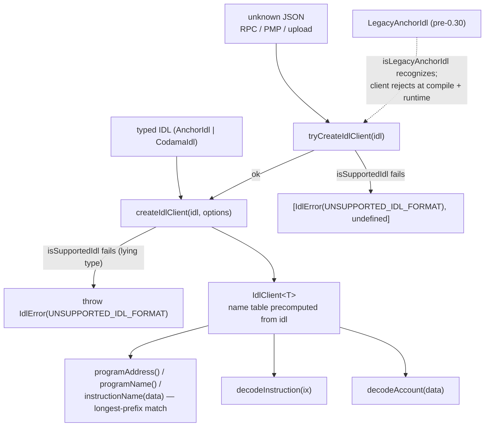
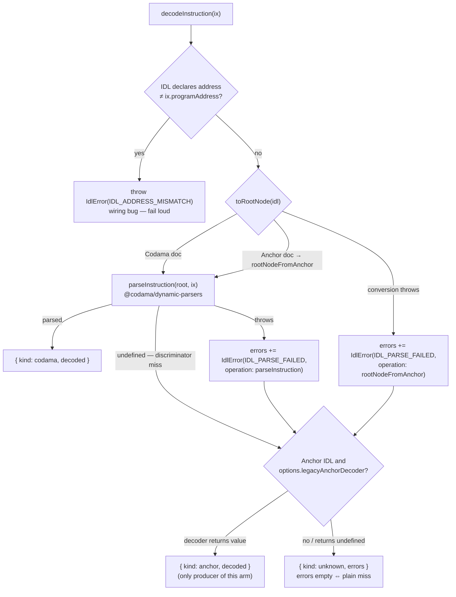

## Context

The package wraps one IDL document into a client whose decode results are discriminated unions narrowed statically per standard. Everything below is shipped code (`src/`), not a plan — this design records the architecture and the reasoning so the extraction pieces (app façade, MCP endpoint) build on a documented contract.

### Client flow

Construction — untrusted input goes through the error-first route, typed input through the throwing route; both land on the same client:

Instruction decode — single codama-normalized pipeline; the anchor arm exists only via the injected escape hatch:

`decodeAccount(data)` runs the same pipeline via `parseAccountData` — no address check, no legacy fallback; a throw collects `ACCOUNT_DECODE_FAILED` (with `dataLength` + standard) into the `unknown` arm. The handler-map overloads dispatch any decode over `{ anchor | codama | unknown }`; totality is enforced by the types (a Codama client's map has no `anchor` key), and a runtime miss throws `MISSING_DECODE_HANDLER` (bypassed-types tripwire).

## Goals / Non-Goals

**Goals:**

- One decode engine for both standards; typed results that make impossible arms unwritable per standard.
- Parsed-data only — the package returns data; rendering, hooks, ErrorBoundaries are app-side layers.
- Error-as-data: decode failures ride the `unknown` arm as coded `IdlError`s; consumers map codes to their own severities/UI.
- Real-artifact tests: fixture Anchor programs build genuine IDLs so discriminators and shapes are sha256-true, not invented.

**Non-Goals:**

- IDL fetching/resolution (mcp-endpoint Piece A) and the Anchor-rich decode path — events, nested account groups via anchor `Program` (Piece B).
- Legacy pre-0.30 decoding — consumers own it; the package only recognizes the shape.
- Rendering/React composition of decoded data.

## Decisions

- **Codama-normalized single pipeline** — Anchor documents convert via `@codama/nodes-from-anchor`, then one engine (`@codama/dynamic-parsers`) decodes everything. Alternative (two engines, anchor-first) rejected: double maintenance for the same bytes. Trade-off: the conversion loses Anchor byte-array discriminator naming in the Codama name table (asserted in the integration suite as a known limitation).
- **Anchor arm = escape hatch only** — `legacyAnchorDecoder` is injected via options, never bundled, and is the sole producer of `{ kind: anchor }` until Piece B. Keeps the package free of app-specific Borsh fallbacks.
- **`unknown` arm carries `errors: IdlError[]`** — a discriminator miss is a plain miss (`errors: []`), a pipeline failure carries coded errors. Known review finding: the length convention is undocumented and the fallback can mask collected errors — tracked as follow-ups in `.claude/plans/idl-client-package.md`.
- **Guards over a `standard` field** — `isAnchorStandard`/`isCodamaStandard` narrow `IdlClient<T>`; a string field would invite untyped branching.
- **Codama payloads typed from the engine** (`NonNullable<ReturnType<typeof parseInstruction>>`); Anchor payloads stay opaque `unknown` until Piece B defines the real shape — consumers cannot couple to a guess.
- **Errors follow `@codama/errors`** — stable numeric codes (never renumbered), context required exactly when a code declares one, error-first `Result` tuples (deliberate deviation from mcp-endpoint D6 order, recorded there).

## Risks / Trade-offs

- [Converted Codama docs lose byte-array discriminator names → whole name table can be empty] → native-Anchor route resolves the same instructions; extending `codamaDiscriminator` (constant nodes, u64+ formats) is a recorded follow-up.
- [Fallback success discards collected pipeline errors — silent failure] → review follow-up: surface them (`recoveredFrom` or `onPipelineError`) before Piece B removes the escape hatch.
- [Tests require the Rust/Anchor toolchain (pretest builds fixture programs)] → accepted deliberately; loaders resolve program packages so the failure mode is a named module, and DEVELOPMENT.md documents the toolchain.
- [`IdlVersion` wildcard `'0.30.1'` collapses into the semver template type] → decorative type member; single-sourcing from the constant is a recorded follow-up.
